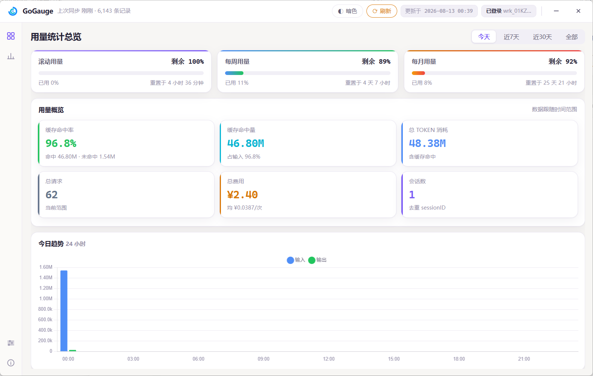
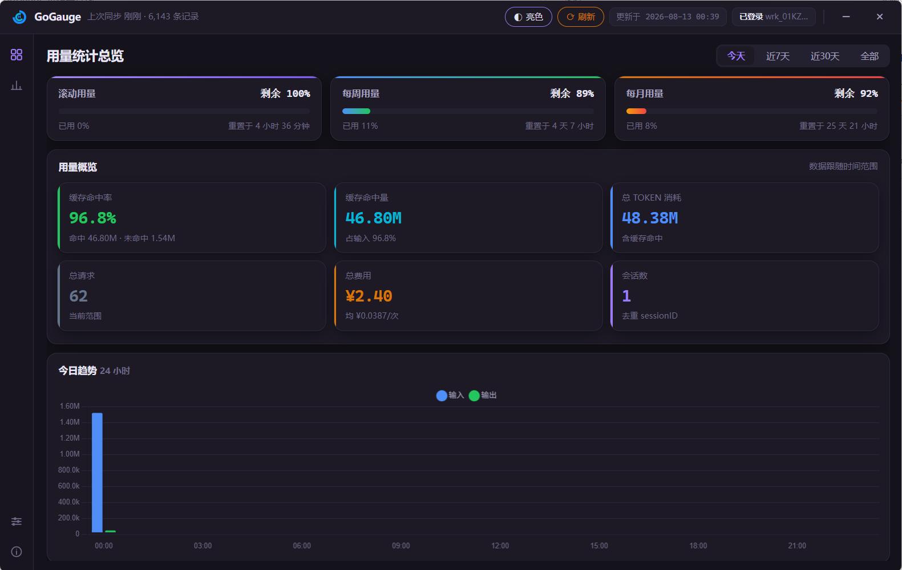
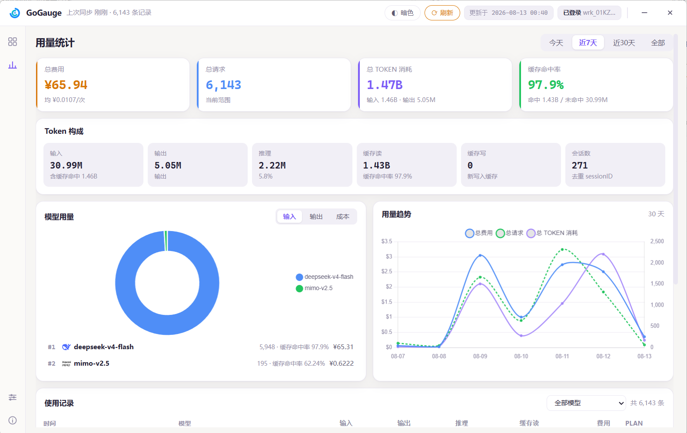
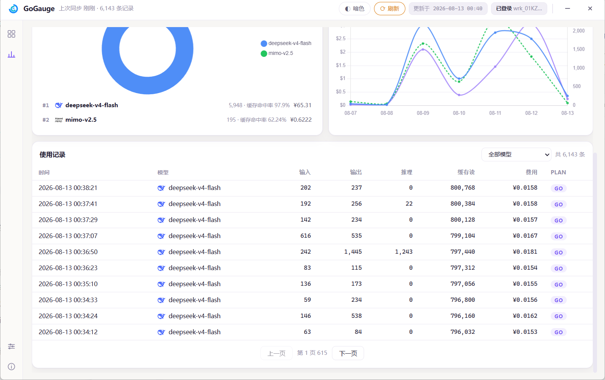
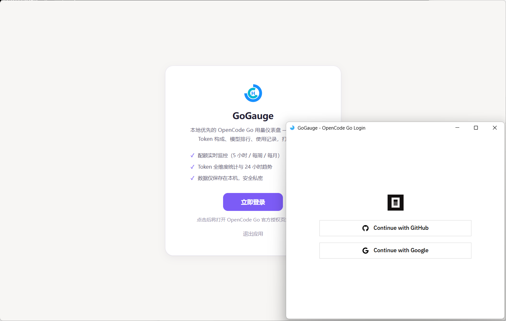
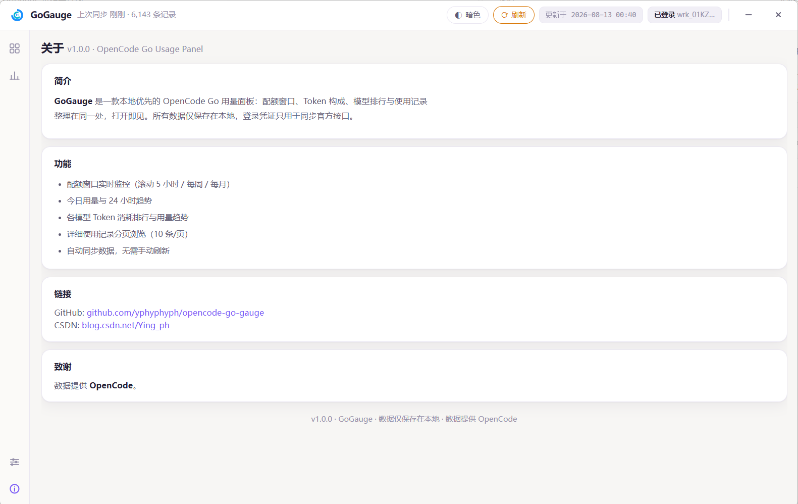

# GoGauge — OpenCode Go Usage Dashboard

<p align="center">
  
</p>

<p align="center">
  <b>A local-first usage dashboard for OpenCode Go</b>: quota windows, token breakdown, model ranking and usage records — all in one place.
</p>

<p align="center">
  <a href="./README.md">🇨🇳 中文</a>
</p>

---

## 📸 Screenshots

| Home (Light) | Home (Dark) |
|:---:|:---:|
|  |  |

| Stats | Records |
|:---:|:---:|
|  |  |

| Settings | Login | About |
|:---:|:---:|:---:|
|  |  |  |

---

## ✨ Features

- **Quota monitoring**: 5h rolling / weekly / monthly windows with progress bars, remaining % and reset countdown
- **Usage overview**: cache hit rate / hit amount / total tokens (incl. cache hits) / requests / cost / sessions
- **Today's trend**: 24-hour input / output bar chart
- **Usage stats**: token breakdown (input / output / reasoning / cache read / cache write / sessions), model usage donut + ranking, cost / requests / total tokens triple-line trend
- **Usage records**: 10 per page with model filtering
- **Built-in WebView login**: independent login window opens the official auth page, auto-fills cookie & workspace — no manual copy-paste
- **Auto sync**: incremental sync (1/5/15/30 min) + sync range (30/60/90/180 days / All)
- **Dual themes**: light / dark toggle; bilingual UI (中文 / English)
- **System tray**: closing the window minimizes to tray; brand logo icons
- **Local-first**: all data stays in local SQLite; credentials are only used to sync official APIs

## 🖥 Quick Start

### Binary (Windows)

Download `GoGauge.exe` from [Releases](../../releases) (single file, no install):

1. Double-click to run, click "Login Now" on the welcome page — an official auth window pops up
2. After login, the dashboard loads and usage data syncs automatically
3. Data is stored in the `data\` folder next to the exe

> Requires Windows 10/11 (WebView2 Runtime built-in). Closing the window minimizes to the system tray.

### From Source

```bash
pip install -r requirements.txt
python entry.py
```

### Build

```bash
build.bat
```

Output: `dist\GoGauge.exe` (~38 MB, --noconsole, logo icon and tray support included).

## 📊 Data Notes

- **Source**: opencode.ai workspace usage API (`/_server` server-fn) + quota page HTML parsing
- **Total tokens** = input (incl. cache hits) + output + reasoning
- **Cache hit rate** = hits / (hits + misses)
- **Cost**: raw USD; CNY converted via open.er-api.com live FX rate (24h cache)
- Implementation reference: [68HUB](https://github.com/evanfu0110/68hub) (MIT) — API call & parsing approach

## 🔒 Privacy

- Login cookie stays on your machine only — never logged, never uploaded
- Usage data is stored entirely locally; the app contains no telemetry

## 🛠 Tech Stack

Python · pywebview (WebView2) · SQLite · Chart.js · pystray

## 📬 Contact

- GitHub: [yphyphyph/opencode-go-gauge](https://github.com/yphyphyph/opencode-go-gauge)
- CSDN: [Ying_ph](https://blog.csdn.net/Ying_ph)

## 📄 License

[MIT](LICENSE) © GoGauge
